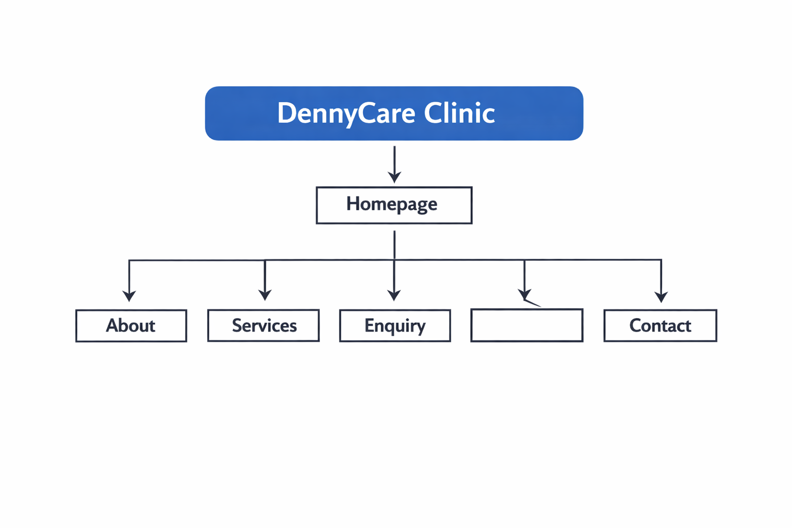
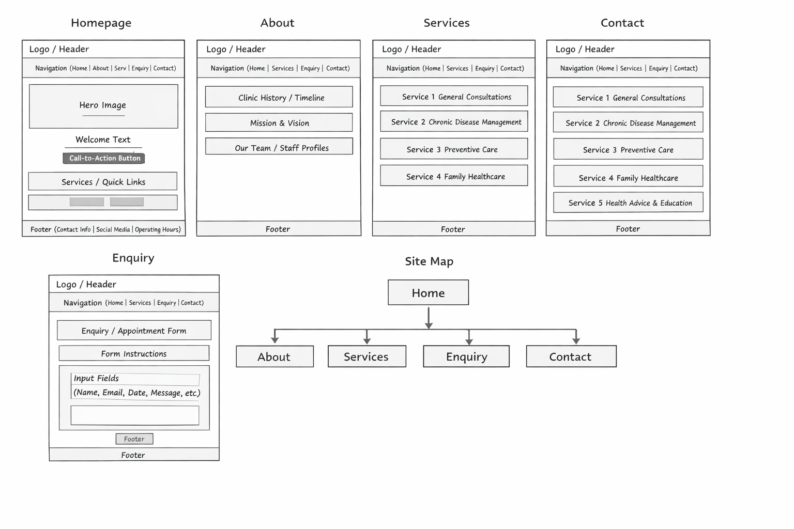

# DennyCare Clinic Website

## Student Information
- Name: [Dennisious Moima]
- Student Number: [ST10500239]
- Module: Web Development
- Project: Part 1 

---

## Project Overview
This project involves the design and development of a professional website for DennyCare Clinic, a local private healthcare provider. The website aims to provide essential information about the clinic, its services, and allow users to make enquiries easily.

---

## Website Goals and Objectives
- Provide clear information about the clinic and its services
- Improve accessibility for patients
- Allow users to submit enquiries online
- Create a simple and user-friendly navigation experience

---

## Key Features and Functionality
- Homepage with clinic introduction
- About Us page with history, mission, and vision
- Services page listing healthcare services
- Enquiry page with a user input form
- Contact page with clinic details and locations
- Functional navigation menu across all pages

---

## Sitemap
The sitemap shows the structure of the website and how pages are connected.

---

## Wireframe
The wireframe illustrates the layout and structure of the website pages.

---

## Timeline and Milestones
- Week 1: Project planning and proposal
- Week 2: Content research and sitemap creation
- Week 3: Wireframe design and folder structure
- Week 4: HTML structure development

---

## Part 1 Details
This part of the project includes:
- Project proposal
- Content research and sourcing
- Sitemap and wireframe design
- File and folder structure
- Basic HTML structure for all pages
- Navigation implementation

---

## Changelog
- Created project folder structure
- Added sitemap and wireframe
- Created HTML pages (index, about, services, enquiry, contact)
- Implemented navigation across all pages
- Added basic content and form structure

---

## References (Harvard Style)

W3Schools. (2024) *HTML Tutorial*. Available at: https://www.w3schools.com/html/ (Accessed: 19 March 2026).

MDN Web Docs. (2024) *HTML: HyperText Markup Language*. Available at: https://developer.mozilla.org/ (Accessed: 19 March 2026).

Pixabay. (2024) *Free Images*. Available at: https://pixabay.com/ (Accessed: 19 March 2026).

Pexels. (2024) *Free Stock Photos*. Available at: https://www.pexels.com/ (Accessed: 19 March 2026).